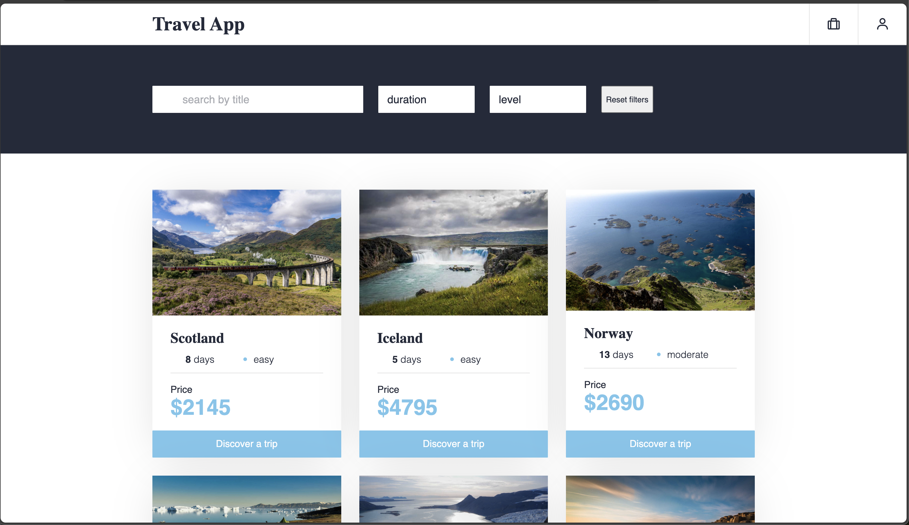

## **Technologies**

- [HTML](https://html.spec.whatwg.org/multipage/)
- [CSS](https://www.w3.org/Style/CSS/)
- [TypeScript](https://www.typescriptlang.org/)
- [React](https://react.dev/)

## **Using**

**If you want to use this project for your own purposes, you should:**

1. Clone the repository to your folder;
2. Go to project;
3. Installing all dependencies;

```sh
 1. git clone https://github.com/miller-113/travel-app.git
 2. cd travel-app
 3. yarn
    #or
    npm install
    #or
    pnpm install
```

### Requirements

To install and run the project, you need [NodeJS](https://nodejs.org/).

### Starting the `Client`

To start the `client`, run the command:

```sh
yarn dev
#or
npm dev
#or
pnpm dev
```

### `Build` creation

To run a production `build`, run the command:

```sh
yarn build
#or
npm build
#or
pnpm build
```

<hr>
